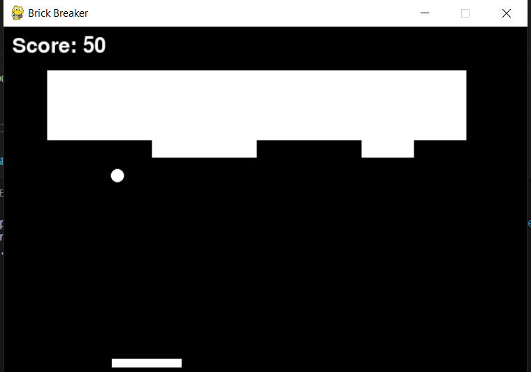

Design an intelligent agent using machine learning to play a brick breaker game, with the ability to make decisions based on ball position and speed, training a decision tree for movement.
Here's the screenshot after executing the code. But first make sure that all the libraries imported in the code are installed in the system.

